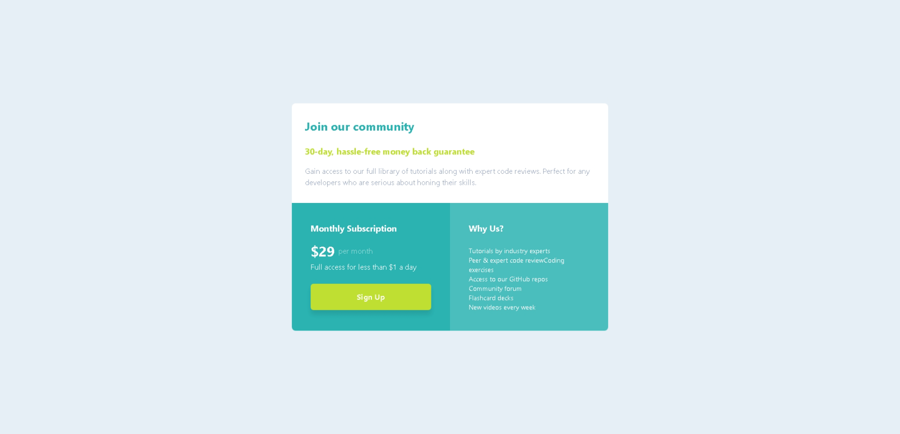

# Frontend Mentor - Single Price Grid Component Solution

This is my solution to the [Single price grid component challenge on Frontend Mentor](https://www.frontendmentor.io/challenges/single-price-grid-component-5ce41129d0ff452fec5abbbc). This project helped reinforce my understanding of responsive layouts and how to work with Tailwind CSS utilities in a real-world component scenario.

## Table of contents

- [Frontend Mentor - Single Price Grid Component Solution](#frontend-mentor---single-price-grid-component-solution)
  - [Table of contents](#table-of-contents)
  - [Overview](#overview)
    - [The challenge](#the-challenge)
    - [Screenshot](#screenshot)
    - [Links](#links)
  - [My process](#my-process)
    - [Built with](#built-with)
    - [What I learned](#what-i-learned)
    - [Continued development](#continued-development)
    - [Useful resources](#useful-resources)
  - [Author](#author)
  - [Acknowledgments](#acknowledgments)

## Overview

### The challenge

Users should be able to:

- View the optimal layout depending on their device's screen size
- See a hover state on desktop for the Sign Up call-to-action

### Screenshot



### Links

- Solution URL: [https://www.frontendmentor.io/solutions/single-price-grid-component---tailwindcss-ktgZ1b7JC0](https://www.frontendmentor.io/solutions/single-price-grid-component---tailwindcss-ktgZ1b7JC0)
- Live Site URL: [https://single-price-grid-component-nine-flame.vercel.app/](https://single-price-grid-component.vercel.app)

## My process

### Built with

- Semantic HTML5 markup
- Tailwind CSS
- Mobile-first responsive design
- Utility-first CSS approach
- Google Fonts (Karla)

### What I learned

Through this challenge, I strengthened my understanding of utility-first CSS using Tailwind. I learned how to:

- Structure responsive layouts with `md:grid-cols-2`
- Apply custom classes for consistent shadows and color schemes
- Use utility classes to create clean spacing, typography, and button states

```html
<div class="grid text-white bg-primary md:grid-cols-2">
  <!-- Responsive 2-column layout using Tailwind -->
</div>
```

```css
/* Custom shadow class used in the component */
.c-shadow {
  box-shadow: 0 10px 10px rgba(0, 0, 0, 0.1);
}
```

### Continued development

I’d like to explore:

- Creating reusable components using Tailwind’s `@apply` directive
- Adding animation effects and accessibility enhancements
- Converting similar UI challenges into React components

### Useful resources

- [Tailwind CSS Documentation](https://tailwindcss.com/docs) – Essential for looking up utility classes and best practices
- [Frontend Mentor Community](https://www.frontendmentor.io/community) – Helpful for feedback and inspiration
- [Google Fonts: Karla](https://fonts.google.com/specimen/Karla) – Font used in the challenge

## Author

- Website – [Fawaz Iwalewa](https://iwaola.me)
- Frontend Mentor – [@fawaziwalewa](https://www.frontendmentor.io/profile/fawaziwalewa)
- Twitter – [@iwalewa_fawaz](https://x.com/iwalewa_fawaz)

## Acknowledgments

Thanks to the Frontend Mentor platform for providing consistent design-focused challenges. I also appreciate the Tailwind CSS community for helping me troubleshoot utility class issues.
